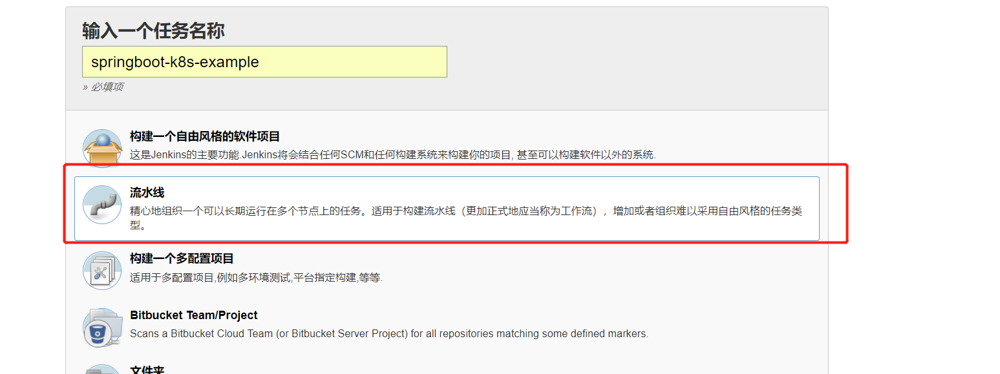
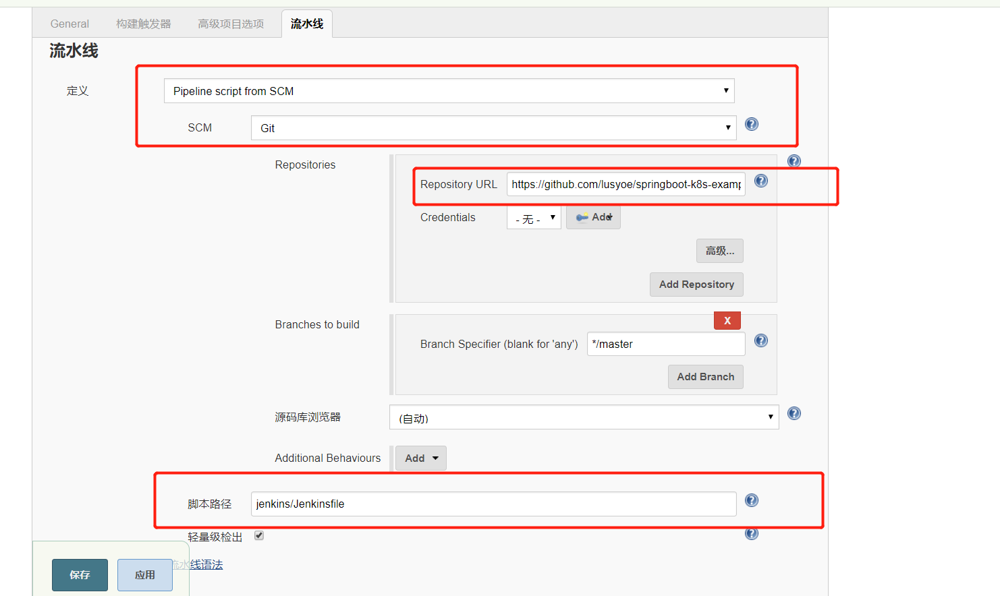

# Jenkins CI/CD on Kubernetes

基于K8s的Jenkins CI/CD项目实战

## Jenkins创建项目

## Jenkins项目配置

参考文档：
> [Jenkins CI/CD on Kubernetes部署配置](https://github.com/gjmzj/kubeasz/blob/master/docs/guide/jenkins.md)  
> [Kubernetes 拉取私有仓库镜像](https://blog.csdn.net/lusyoe/article/details/79587914)
